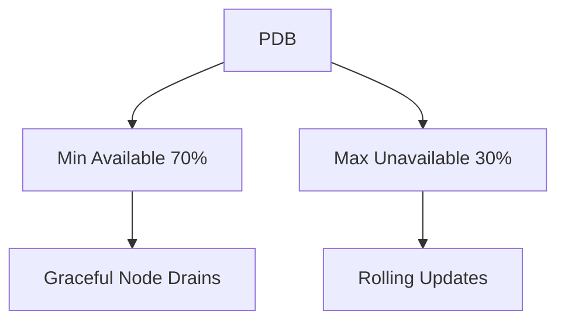
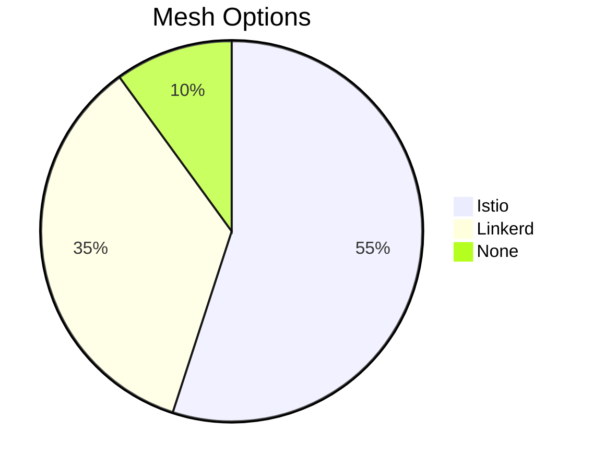

# Agent Service Deployment Guide

## Prerequisites
- Kubernetes cluster (AKS recommended)
- Helm 3.10+
- Azure CLI (if using AKS)
- Istio/Linkerd (optional)

## Installation

### Basic Deployment
```bash
helm install agent-service ./charts/agent-service \
  --namespace ai-agents \
  --create-namespace \
  --set istio.enabled=true \
  --set istio.install.enabled=true \
  --set redis.auth.password=$REDIS_PASSWORD \
  --set redis.resources.requests.memory=512Mi \ # Optional override
  --set redis.resources.requests.cpu=200m
```

### Verification Commands
```bash
# Check all components
kubectl get pods -n ai-agents -w

# Verify Redis connection
kubectl exec -it deployment/agent-service -n ai-agents -- \
  redis-cli -h agent-service-redis-master -a $REDIS_PASSWORD PING

# Check Istio injection
kubectl describe pod -l app.kubernetes.io/name=agent-service -n ai-agents | grep istio-proxy
```

### Required Secrets Preparation
```bash
# Generate password if not exists
REDIS_PASSWORD=$(openssl rand -base64 24 | tr -d '\n')

# Store in Kubernetes secret (alternative to --set)
kubectl create secret generic redis-secrets -n ai-agents \
  --from-literal=password=$REDIS_PASSWORD
```

### Production Values
```yaml
# values-prod.yaml
replicaCount: 5
autoscaling:
  enabled: true
  minReplicas: 5
  maxReplicas: 20

ingress:
  enabled: true
  annotations:
    appgw.ingress.kubernetes.io/backend-protocol: "https"
```

## One-Command Production Deployment:

```bash
helm upgrade --install agent-service ./charts/agent-service \
  -n ai-agents \
  --create-namespace \
  --set istio.enabled=true \
  --set istio.install.enabled=true \
  --set redis.auth.password=$REDIS_PASSWORD \
  --set openai.apiKey=$OPENAI_KEY \
  --set ingress.hosts[0].host=agents.yourdomain.com \
  --values values-prod.yaml
```


## Post-Install Verification
```bash
kubectl get pods -n ai-agents
kubectl get hpa -n ai-agents
kubectl describe ingress agent-service -n ai-agents
# Check Redis throughput
kubectl exec -it statefulset/agent-service-redis-master -n ai-agents -- \
  redis-cli info stats | grep instantaneous_ops_per_sec

# Verify Istio metrics
istioctl proxy-config clusters deployment/agent-service -n ai-agents | grep redis
```

## Uninstallation
```bash
helm uninstall agent-service -n ai-agents
kubectl delete pvc -l app.kubernetes.io/instance=agent-service
```

## PodDisruptionBudget


## Service Meshes
