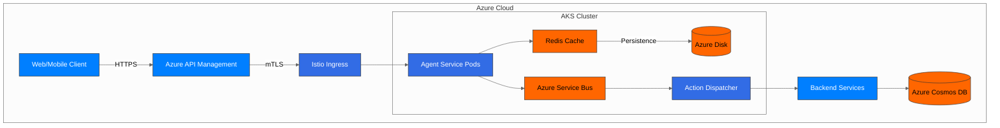
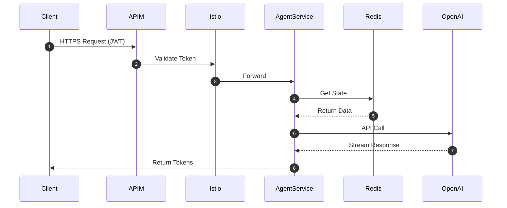
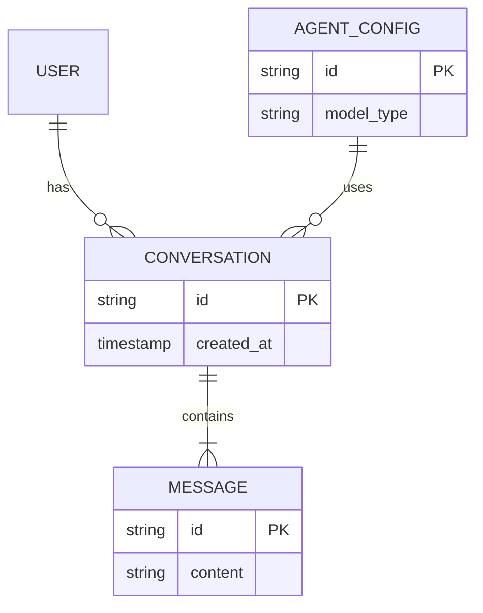
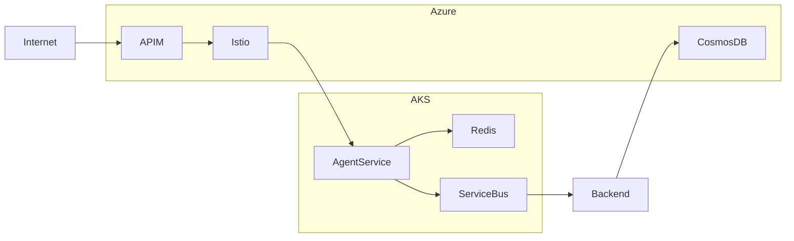
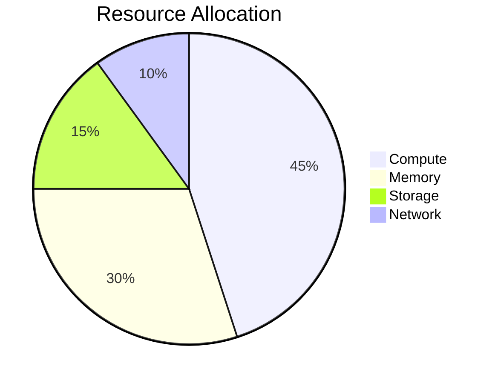

### ARCHITECTURE.md

# AI Agent System Architecture

## Overview Diagram

## Component Flow Details
## Component Sequence
- [Request Lifecycle](./flows/request_lifecycle.md)

## Data Relationships
- [Data Relationships](./flows/data_relationships.md)

## Network Topology

## Key Metrics

## Key Decisions

1. **Streaming Architecture**:
   - FastAPI for native streaming support
   - AKS with HPA for scaling streaming connections
   - Redis for conversation state management

2. **Action Processing**:
   - Decoupled via Service Bus
   - Separate consumer service for reliability
   - Dead-letter queue for failed actions

3. **Evaluation Strategy**:
   - Offline: Pre-deployment with test cases
   - Online: Real-user interaction metrics
   - Versioned configurations for bisecting issues