# AI Agent Evaluation Strategy
**Evaluation Strategy**:
   - Offline: Pre-deployment with test cases
   - Online: Real-user interaction metrics
   - Versioned configurations for bisecting issues
   
## Comprehensive Evaluation Framework

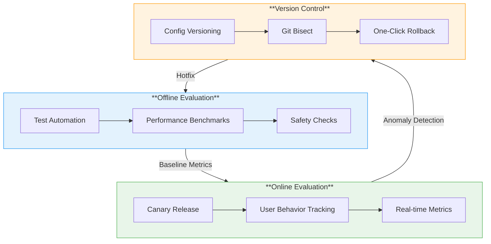
   
## 1. Process Flow Diagram
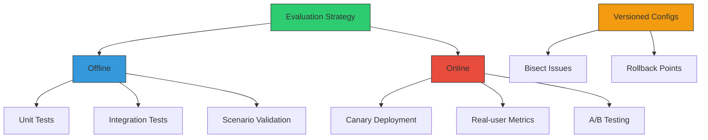
	
## 2. Timeline View
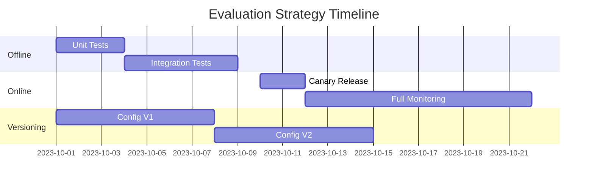

## 3. Comparison Matrix
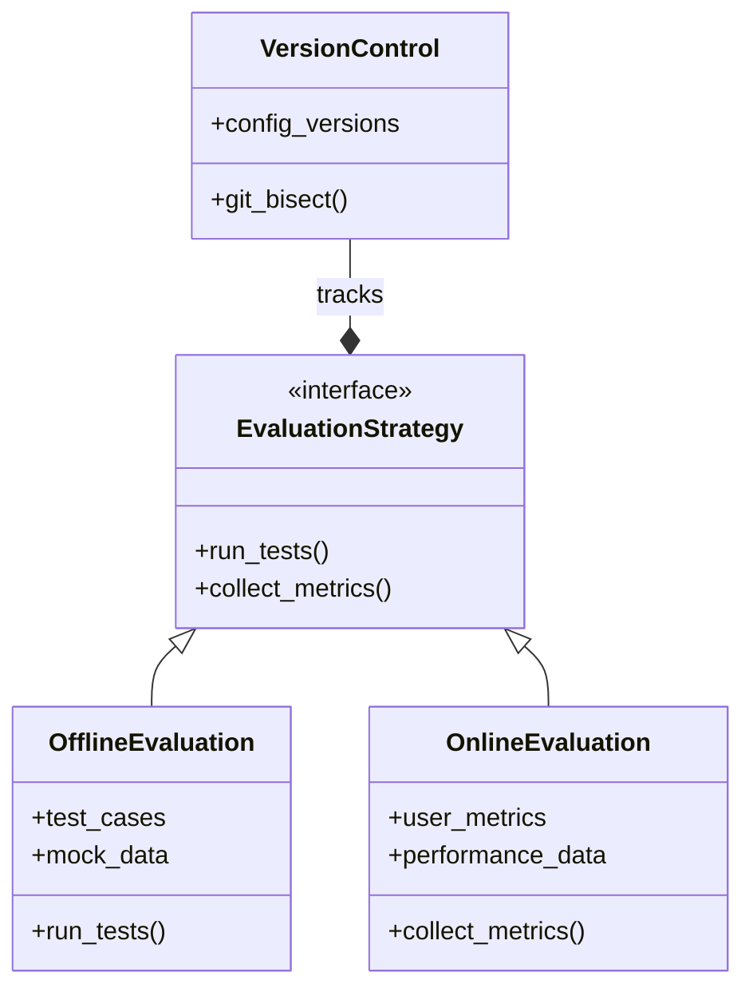

## 4. Metric Tracking Dashboard
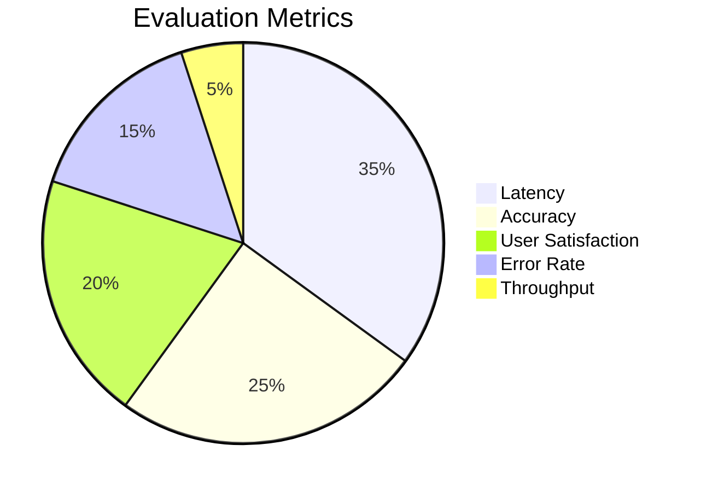

## 5. Full Strategy Visualization
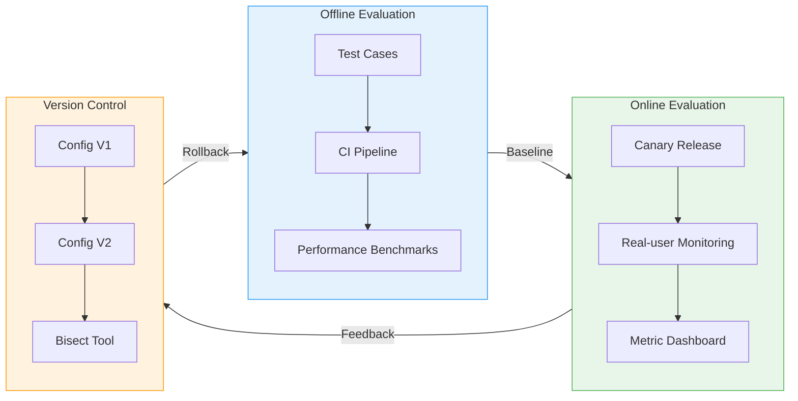

### 5.1 Offline Evaluation
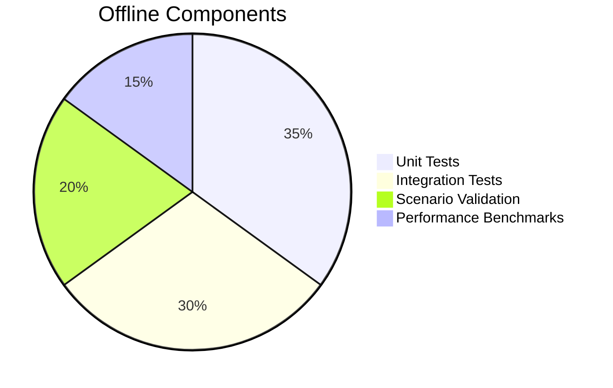

#### Python Example test automation
def run_offline_eval(config):
    test_results = {
        'accuracy': test_accuracy(config),
        'latency': test_latency(config),
        'safety': test_safety_guardrails(config)
    }
    assert test_results['accuracy'] > 0.85, "Accuracy threshold not met"
	
### 5.2 Online Evaluation
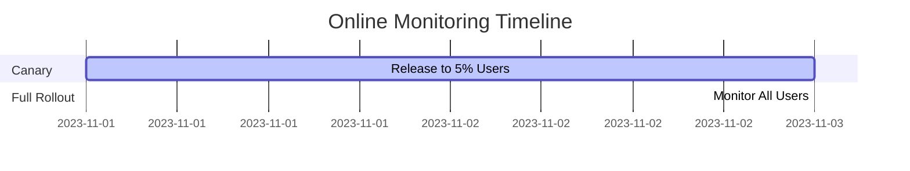

### 5.3  Versioned Configs
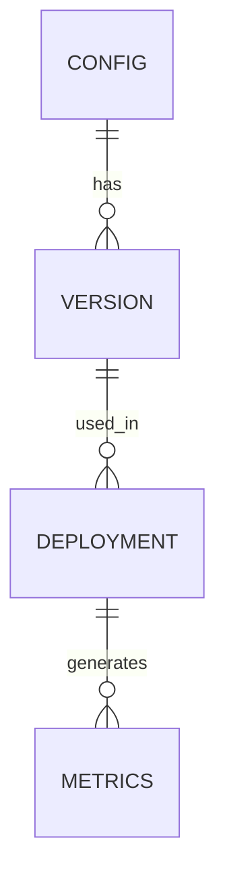

## 6. Implementation Guide
### Setup Monitoring
 Install monitoring stack
helm install monitoring prometheus-community/kube-prometheus-stack \
  --set grafana.defaultDashboardsEnabled=true
	
### Create Evaluation Job
# evaluation-job.yaml
apiVersion: batch/v1
kind: CronJob
metadata:
  name: agent-evaluator
spec:
  schedule: "0 * * * *"
  jobTemplate:
    spec:
      containers:
      - name: evaluator
        image: evaluator:latest
        args: ["--offline", "--online", "--bisect"]
		
## 7. Critical Connections
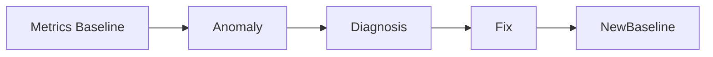

## 8. Visual Summary
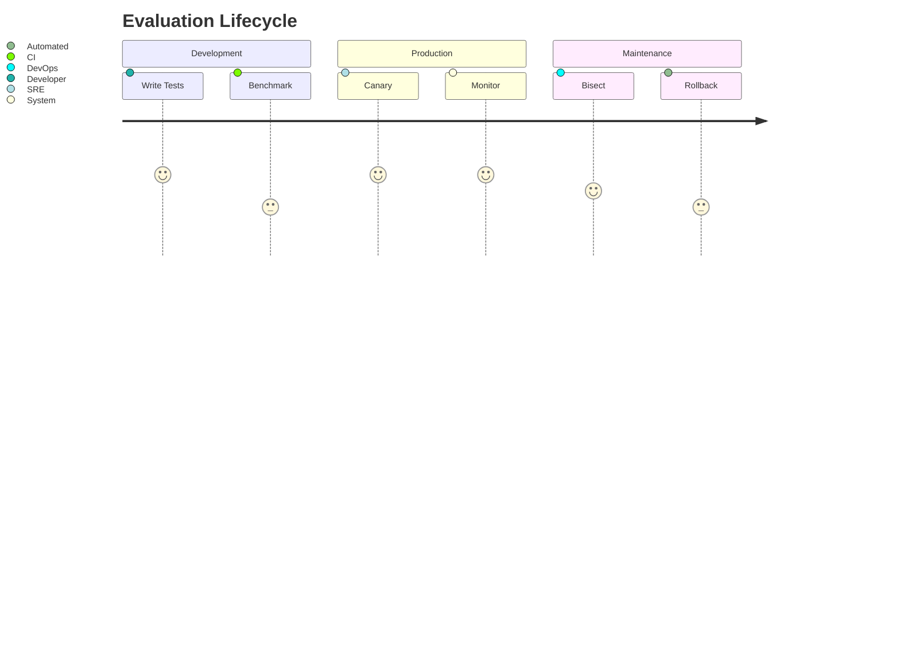

## 9. Troubleshooting
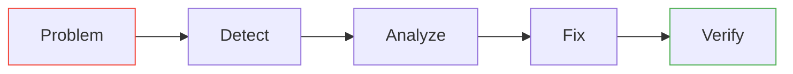

		
	
		