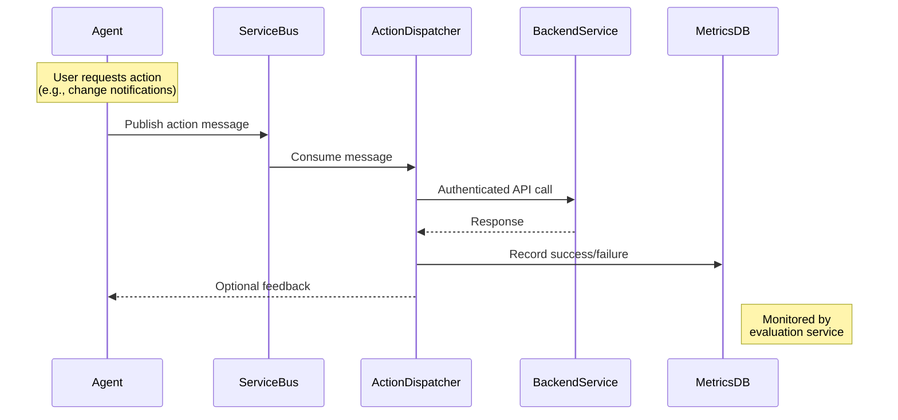

# User Flow

## Chat Interaction

```mermaid
sequenceDiagram
    participant User
    participant Frontend
    participant APIM
    participant AgentService
    participant OpenAI
    participant ServiceBus
    
    User->>Frontend: Sends message
    Frontend->>APIM: POST /chat (with auth)
    APIM->>AgentService: Forward request
    AgentService->>Redis: Get conversation history
    AgentService->>OpenAI: Stream request
    OpenAI-->>AgentService: Stream tokens
    AgentService-->>APIM: Stream response
    APIM-->>Frontend: Stream tokens
    Frontend-->>User: Display tokens
    AgentService->>ServiceBus: Queue actions (if any)
	
## Configuration Update Flow

```mermaid
flowchart TD
    A[Engineer creates new agent config] --> B[System runs offline evaluations]
    B --> C{Passed?}
    C -->|Yes| D[Configuration reviewed via PR]
    C -->|No| A
    D --> E[Approved config deployed to canary]
    E --> F[Online evaluations monitor performance]
    F --> G{Metrics met?}
    G -->|Yes| H[Full rollout]
    G -->|No| I[Rollback]
	
	
## Configuration Update Flow

```mermaid
flowchart TD
    A([Engineer creates config]) --> B[Save in /agent-configs]
    B --> C[Automated offline eval]
    C --> D{Passed?}
    D -->|No| E[Alert team + Reject PR]
    D -->|Yes| F[Create PR]
    F --> G{Approved?}
    G -->|No| H[Request changes]
    G -->|Yes| I[Deploy to canary]
    I --> J[Online monitoring]
    J --> K{Metrics OK?}
    K -->|Yes| L[Full rollout]
    K -->|No| M[Rollback]
    style A stroke:#4CAF50,stroke-width:3px
    style E stroke:#f44336
    style L stroke:#4CAF50
```

### Detailed Steps

1. **Config Creation**:
   ```bash
   # Example config file
   /agent-configs/notification-agent-v1.yaml
   ```

2. **Automated Checks**:
   - Schema validation
   - Safety checks
   - Performance benchmarks

3. **Canary Deployment**:
   ```yaml
   # values-canary.yaml
   agent:
     image: v1.2.3-canary
     config: notification-agent-v1
   ```

4. **Rollback Trigger**:
   ```python
   # monitor.py
   if error_rate > 0.05:
       trigger_rollback()
   ```
## Action Execution Flow



### Flow Explanation
1. **Action Detection**: Agent identifies action requirement from LLM response
2. **Service Bus**: Decouples action processing from main chat flow
3. **Dispatcher**:
   - Validates permissions
   - Retries failed actions
   - Implements circuit breakers
4. **Backend Services**: Existing application APIs
5. **Metrics**: Recorded for online evaluations