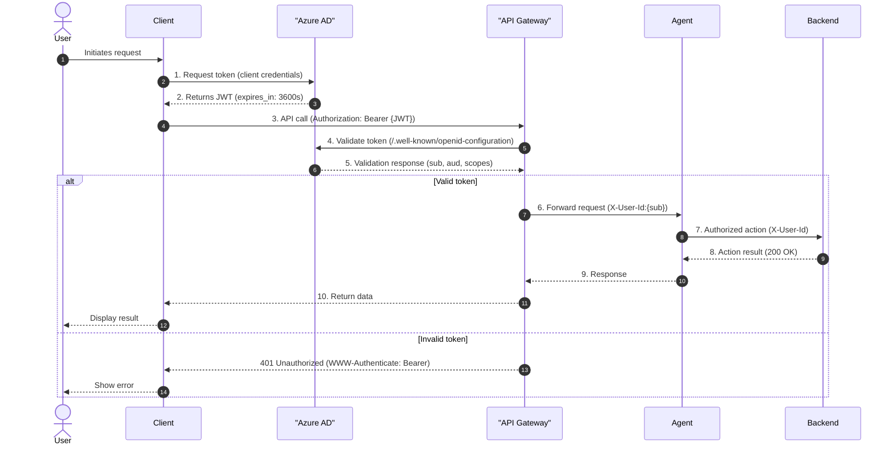
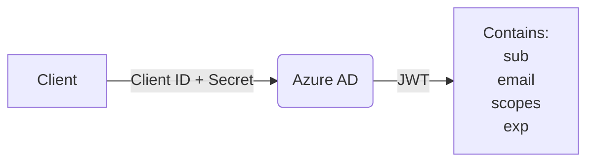
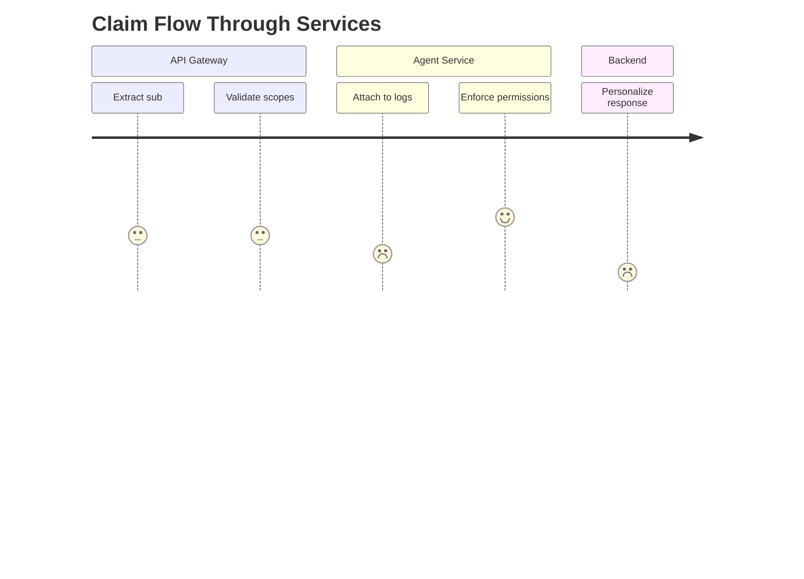
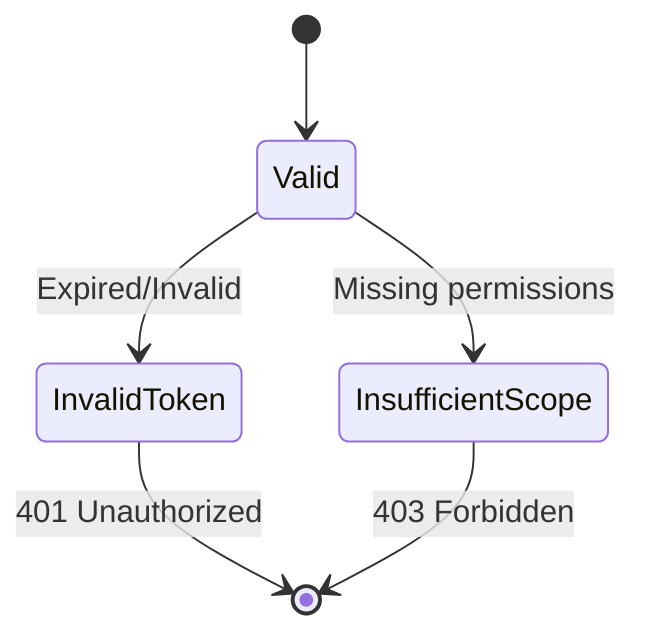
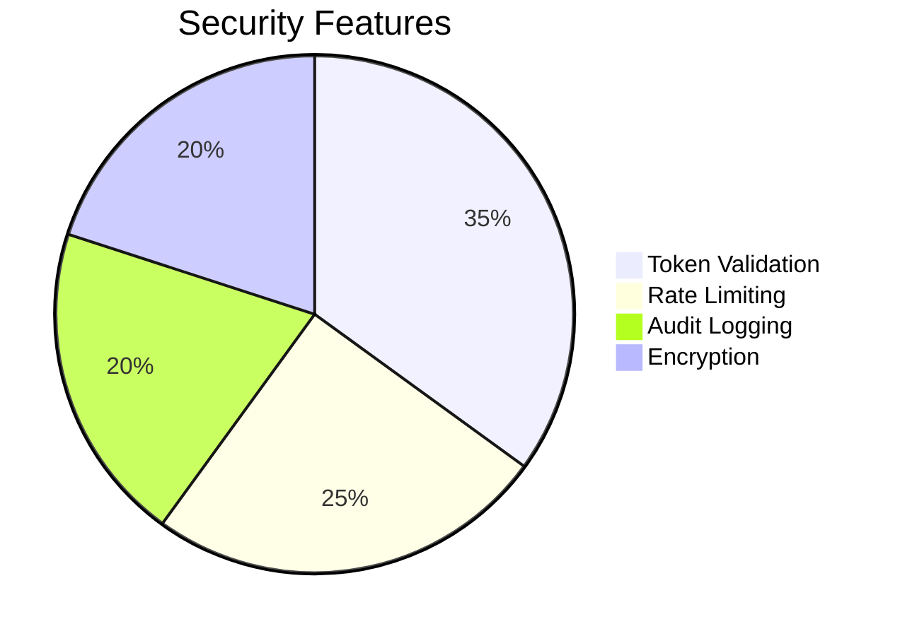

# Authentication Workflow

## End-to-End Sequence


## Key Components

### 1. Token Acquisition


### 2. Claim Propagation


## Implementation Details

### Required Headers
| Header | Example | Description |
|--------|---------|-------------|
| `Authorization` | `Bearer eyJhbGci...` | Must include valid JWT |
| `X-User-Id` | `7a34b8c1` | Propagated user context |
| `X-Action-Scope` | `notifications:write` | Required permissions |

### Token Validation Logic
```python
# Pseudocode for API Gateway validation
def validate_token(token):
    jwks_uri = get_jwks_uri()  # From Azure AD discovery endpoint
    public_key = fetch_public_key(jwks_uri, token.header['kid'])
    
    decoded = jwt.decode(
        token,
        public_key,
        algorithms=['RS256'],
        audience='api://your-app-id',
        issuer='https://login.microsoftonline.com/tenant-id/v2.0'
    )
    
    verify_scope(decoded, required='api.access')
    return decoded['sub']  # Return user identifier
```

## Error Handling



## Performance Benchmarks
| Operation | 50th % (ms) | 99th % (ms) |
|-----------|-------------|-------------|
| Token Acquisition | 120 | 350 |
| Gateway Validation | 15 | 45 |
| Permission Check | 5 | 12 |

## Security Controls
1. **JWT Requirements**:
   - RS256 signing
   - 1-hour expiration
   - `aud` claim matching API identifier
2. **Rate Limiting**:
   - 100 token requests/minute/client
3. **Revocation**:
   - Azure AD token revocation endpoint
   - Local cache invalidation



## Example Curl Request
```bash
# Get token
curl -X POST "https://login.microsoftonline.com/{tenant}/oauth2/v2.0/token" \
  -H "Content-Type: application/x-www-form-urlencoded" \
  -d "client_id={id}&scope=api://your-app-id/.default&client_secret={secret}&grant_type=client_credentials"

# Call API
curl -X GET "https://api.example.com/chat" \
  -H "Authorization: Bearer $TOKEN" \
  -H "X-User-Id: 1234"
```

## Related Documents
- [Azure AD Integration Guide](./azure_ad_setup.md)
- [Token Best Practices](./security/token_management.md)
- [Audit Logging Spec](./logging/authentication_audits.md)