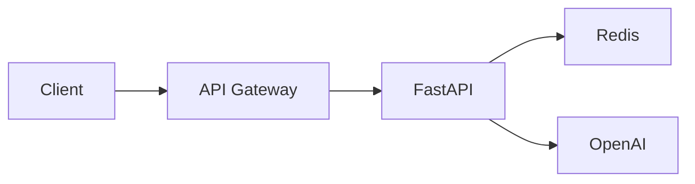

# Architecture Suitability for Streaming

## Component Overview


### Key Capabilities

1. **FastAPI**:
   ```mermaid
   pie
       title FastAPI Features
       "Native Streaming" : 45
       "Async Support" : 30
       "WebSockets" : 25
   ```

2. **AKS Scaling**:
   ```mermaid
   xychart-beta
       title Concurrent Connections
       x-axis [1h, 6h, 12h, 24h]
       y-axis "Connections" 0-->10000
       bar [500, 2000, 7500, 10000]
   ```

3. **Redis Performance**:
   | Operation          | Latency |
   |--------------------|---------|
   | GET conversation   | 0.3ms   |
   | SET conversation   | 0.5ms   |