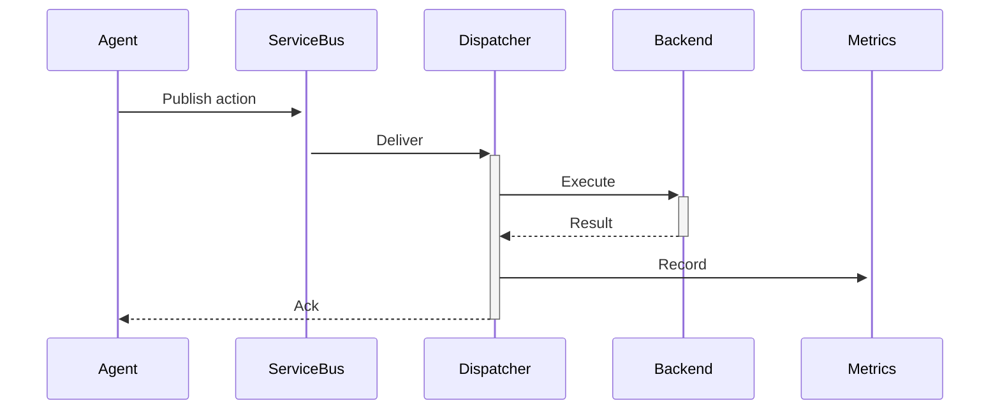
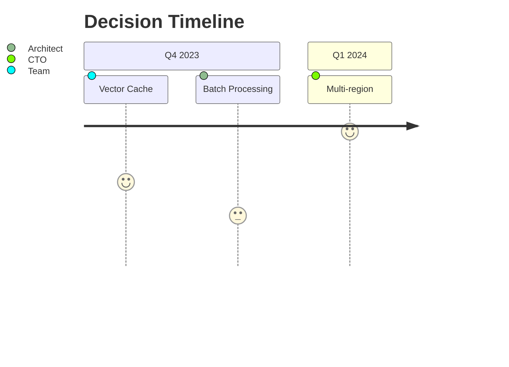

# Design Decisions and Assumptions

## Architecture Decision Records (ADR)

### ADR-001: Configuration Storage
```markdown
# 1. Configuration Versioning System

**Date**: 2025-03-21  
**Status**: Approved  
**Deciders**: CTO, Lead Architect, Dev Manager  

#### Context
Need to manage agent configurations (prompts, model params, tools) with versioning and rollback capabilities.

#### Options Considered
1. **Azure Blob Storage**  
   - (+) Immutable versions  
   - (+) Cost-effective  
   - (-) No query capabilities  

2. **Azure Cosmos DB**  
   - (+) Rich querying  
   - (-) Versioning complexity  

3. **Git Repo**  
   - (+) Change tracking  
   - (-) Operational overhead  

#### Decision
Use **Azure Blob Storage** with:
- Folder per agent type (`/agents/notification_agent/`)
- Semantic versioned files (`v1.2.3.json`)
- Metadata sidecar files (`_versions.csv`)

#### Consequences
- Must build custom query layer
- Version diffs require tooling
```

### ADR-002: Action Processing
```markdown
# 2. Action Processing Framework

**Date**: 2025-04-04  
**Status**: Approved  

#### Decision
Use Azure Service Bus with:
- Dedicated queue per action type  
- Circuit breaker pattern  
- Dead-letter queue for failures  

#### Validation Flow

```

---

## Risk Assessment Workflow

### Risk Register
| ID  | Risk                  | Probability | Impact | Mitigation                    |
|-----|-----------------------|-------------|--------|-------------------------------|
| R1  | OpenAI API throttling | Medium      | High   | Implement exponential backoff |
| R2  | Config rollback fail  | Low         | Critical | Maintain 3 previous versions  |
| R3  | Action queue overflow | High        | Medium | Auto-scale dispatchers        |

### Evaluation Process
1. **Monthly Review Meeting**
   - Engineering leads
   - Product owners
   - Security team

2. **Automated Monitoring**
   ```bash
   # Sample health check
   curl -X POST https://api/risk-eval \
     -d '{"risk_id":"R1", "metrics": {"error_rate": 0.12}}'
   ```

3. **Mitigation Triggers**
   ```python
   if risk_level > RISK_THRESHOLD:
       alert_team()
       auto_rollback()  # For config issues
   ```

---

## Assumption Validation Table

| Assumption                     | Validation Method          | Frequency   | Owner        |
|--------------------------------|----------------------------|-------------|--------------|
| OpenAI latency <2s             | Synthetic transactions     | Hourly      | DevOps       |
| Azure AD handles 10k RPS       | Load testing               | Quarterly   | Security     |
| Service Bus <500ms delay       | Message tracing            | Continuous  | SRE          |

---

## Pending Decisions


## Templates

### ADR Template
```markdown
# [ADR-XXX]: [Short Title]

**Date**: YYYY-MM-DD  
**Status**: Proposed/Approved/Deprecated  

### Context
[What problem are we solving?]

### Decision Drivers
- Driver 1 (e.g. cost)
- Driver 2 (e.g. latency)

### Options Considered
1. [Option A]
2. [Option B]

### Decision Outcome
Chosen option: [X]  
Because: [justification]

### Consequences
- Positive
- Negative
```

### Risk Assessment Template
```markdown
## [Risk ID]: [Risk Name]

**Category**: Security/Performance/Compliance  
**Last Updated**: YYYY-MM-DD  

### Impact Analysis
- Worst-case scenario: 
- Business impact: 

### Mitigation Plan
1. Short-term: 
2. Long-term: 

### Monitoring
- Metrics to watch: 
- Alert thresholds: 
```

---

## Version History
| Version | Changes                     | Approved By       |
|---------|-----------------------------|-------------------|
| v1.0    | Initial baseline            | CTO               |
| v1.1    | Added risk workflows        | Security Lead     |
| v1.2    | Incorporated ADR process    | Lead Architect    |