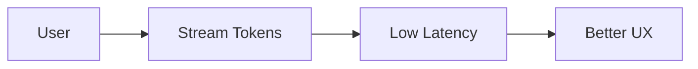
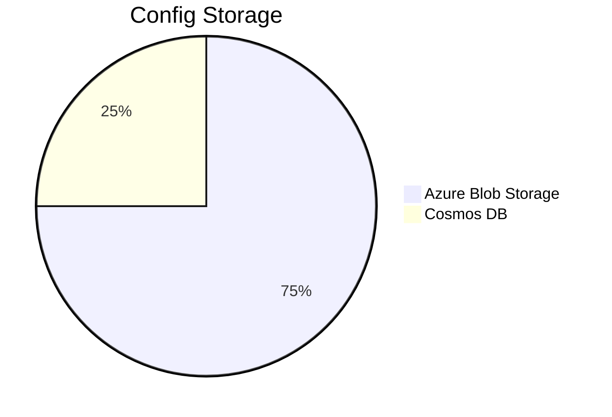
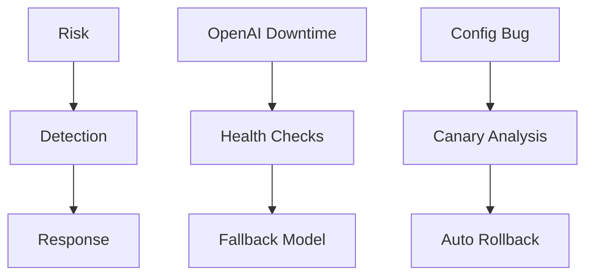

# Design Decisions and Assumptions

## Core Architectural Decisions

### 1. Streaming Chat Interface

- **Decision**: Use FastAPI with native streaming support
- **Rationale**: 
  - Enables token-by-token delivery
  - Reduces perceived latency
- **Assumption**: Azure Load Balancer supports long-lived connections

### 2. Configuration Management

- **Decision**: Versioned configurations in Blob Storage
- **Rationale**:
  - Immutable config versions
  - Easy rollback capability
- **Assumption**: Config changes are infrequent (<5/day)

### 3. Action Processing
- **Decision**: Decouple via Service Bus
- **Tradeoffs**:
  - ✅ Increased reliability
  - ❌ Added complexity
- **Assumption**: Actions can tolerate ~500ms delay

## Key Technology Choices

| Component       | Choice                  | Rationale                          |
|-----------------|-------------------------|------------------------------------|
| Compute         | AKS with HPA            | Auto-scaling for chat workloads    |
| Cache           | Azure Redis             | Low-latency conversation state     |
| Auth            | Azure AD                | Enterprise-grade security          |
| CI/CD           | GitHub Actions          | Tight GitHub integration           |

## Critical Assumptions

1. **OpenAI API**:
   - Stable streaming API
   - Consistent function calling behavior
   - Predictable latency (<2s for first token)

2. **Performance**:
   - 95% of chat responses under 3s
   - Action processing <1s for 99% of requests

3. **Scale**:
   - Initial target: 1,000 concurrent chats
   - Peak: 10,000 RPS during promotions

4. **Security**:
   - Azure AD protects all endpoints
   - Action dispatcher validates all requests

## Risk Mitigation

## Unresolved Questions
1. Should we add a secondary vector cache?
2. Is Azure AD overkill for internal tools?
3. Can we reduce Service Bus costs with batching?

## Revision History
| Version | Date       | Changes                 |
|---------|------------|-------------------------|
| 1.0     | 2025-05-03 | Initial architecture    |
| 1.1     | 2025-05-04 | Added fallback plans    |