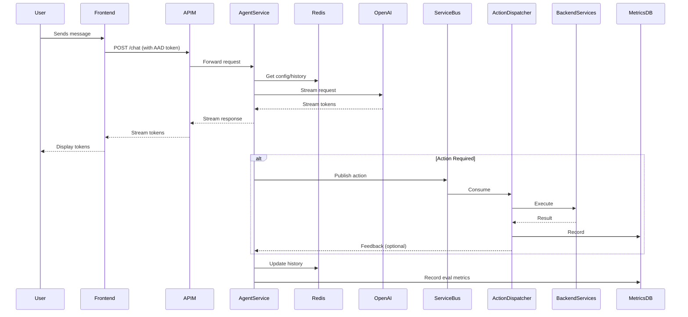
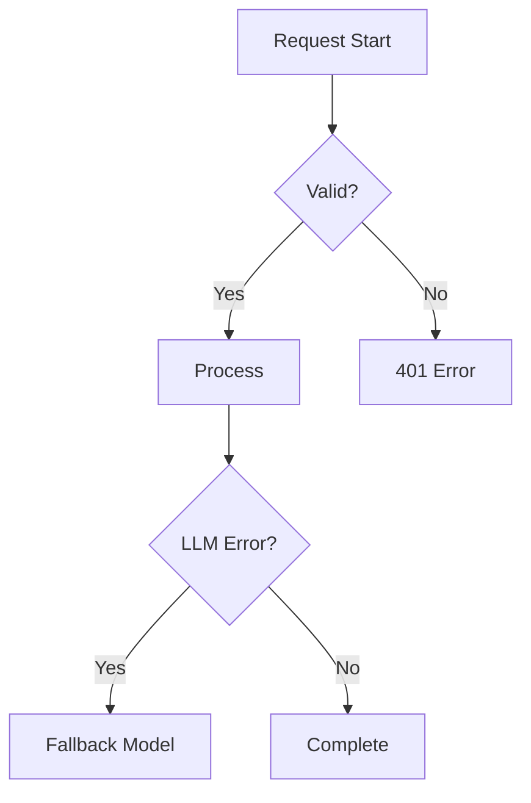

# Request Lifecycle

## Full Sequence Diagram


## Key Phases

1. **Authentication & Routing**
   - Azure AD validates JWT
   - API Gateway routes to appropriate agent

2. **Context Assembly**
   - Retrieves:
     - Agent config (from Blob Storage)
     - Conversation history (from Redis)

3. **LLM Processing**
   - Streaming call to OpenAI
   - Real-time token processing

4. **Action Handling** (Conditional)
   ```mermaid
   flowchart LR
       A[Action Detected] --> B[Service Bus]
       B --> C[Dispatcher]
       C --> D[Backend API]
   ```

5. **Persistence**
   - Conversation history updated
   - Evaluation metrics recorded

## Error Handling Paths
